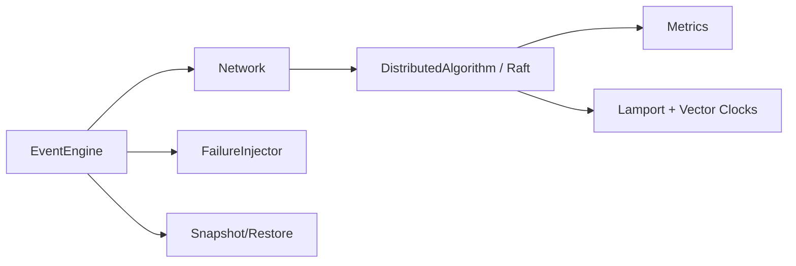

# Deterministic Distributed Systems Simulator (C++17)

## Phase 0 — Architecture and Determinism Contract

### System invariants
1. **Determinism guarantee:** for identical config bytes + seed + binary, execution trace and CSV output are identical.
2. **Event order:** total order is `(timestamp, node_id, event_id)` where `event_id` is monotonic and unique.
3. **Virtual time:** simulation time is discrete `TimeMs`; it advances only when the scheduler pops an event.
4. **Failure model:** crash/recover are explicit scheduled events; crashed nodes ignore messages and timeouts.
5. **Snapshot correctness:** snapshot captures all mutable simulator state (event queue, node state, clocks, network RNG and partition state, metrics).

### Nondeterminism risks and eliminations
- Hash container iteration order → use `std::map`/`std::set`.
- Wall clock or OS timing → no `chrono::system_clock` usage.
- Thread race order → single-threaded core.
- Randomness drift → only per-instance `std::mt19937` seeded from config.
- Hidden global state → state owned by simulator object graph; no mutable globals.

### Module architecture


### State ownership rules
- `DeterministicSimulator` owns all modules and their lifetimes.
- `EventEngine` owns queue and execution log.
- `Network` owns RNG/partition model and schedules only through `EventEngine`.
- Raft node objects own only per-node protocol state.

## Repository Structure

```text
distributed-systems-simulator/
├── core/
├── clock/
├── network/
├── failures/
├── algorithms/
│   └── raft/
├── metrics/
├── experiments/
├── configs/
├── tests/
├── scripts/
├── docs/
├── paper/
├── CMakeLists.txt
└── README.md
```

See `docs/architecture.md` for per-file purpose and dataflow.

## Build
```bash
cmake -S . -B build
cmake --build build
ctest --test-dir build --output-on-failure
```

## Run experiment
```bash
./build/run_experiment configs/example_experiment.json
```

## Determinism check
```bash
./scripts/compare_runs.sh configs/example_experiment.json
```

## Git Commit Plan (Phase 11)
```bash
git init
git add docs README CMakeLists.txt
git commit -m "docs: define deterministic simulator architecture"

git add core clock tests/test_event_engine.cpp tests/test_clocks_and_network.cpp
git commit -m "core: implement deterministic event engine and logical clocks"

git add network failures
git commit -m "sim: add deterministic network and failure injection"

git add algorithms/raft experiments metrics tests/test_raft_and_snapshot.cpp
git commit -m "raft: add simplified deterministic raft and experiment harness"

git add scripts configs docs paper
git commit -m "docs: add experiment scripts paper and architecture notes"
```

## Architectural limitations and potential nondeterminism risks
- Parser is intentionally minimal JSON subset, not full JSON standard.
- Simplified Raft omits persistence, nextIndex/matchIndex, and strict majority commit semantics.
- Snapshot restoration currently relies on callback registry consistency.
- Floating-point use in loss/reorder probabilities can vary across exotic platforms; tested for same toolchain.
